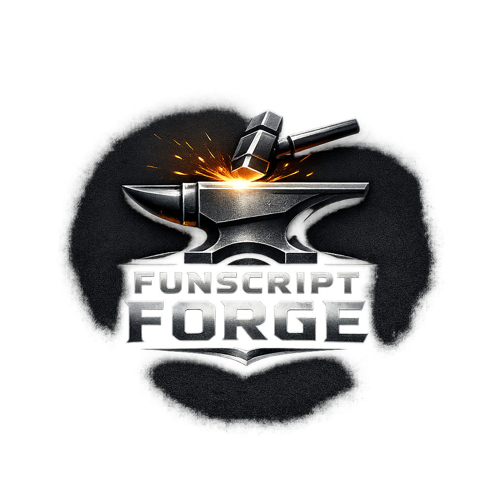

# funscript-forge



A structure-aware post-processor for funscripts. It analyzes the motion
structure of an existing script, lets you review and tag sections through an
interactive UI, and generates an improved script with smoother defaults,
expressive performance sections, and gentle breaks.

---

## Current state

| Capability | Status |
| --- | --- |
| Structural analysis (phases, cycles, patterns, phrases, BPM transitions) | ✅ Available |
| Behavioral classification (8 tags: stingy, giggle, drone, …) | ✅ Available |
| Cross-funscript pattern catalog (persistent JSON) | ✅ Available |
| Interactive assessment viewer (Streamlit UI) | ✅ Available |
| Pattern Editor — batch-fix behavioral issues with per-phrase transforms | ✅ Available |
| Pattern Editor — split a phrase into sub-ranges, each with its own transform | ✅ Available |
| Work-item tagger (performance / break / raw / neutral) | ✅ Available |
| Transform + customize pipeline | ✅ Available via CLI |
| Transform + customize inside the UI | 🔜 Coming soon |

---

## User workflow

### 1 — Analyze

The analyzer reads a `.funscript` file and detects its motion structure,
working through five stages:

```text
actions → phases → cycles → patterns → phrases → BPM transitions
```

- **Phases** — individual up, down, or flat direction segments
- **Cycles** — one complete oscillation (one up + one down phase)
- **Patterns** — cycles with the same direction sequence and similar duration
- **Phrases** — consecutive runs of the same pattern, each with a BPM value
- **BPM transitions** — points where tempo changes significantly between phrases

The output is a single JSON file capturing the full structural picture.

### 2 — Review in the UI

Open the Streamlit app and load your funscript. The **Assessment** tab shows
the full pipeline output — a colour-coded phrase timeline, BPM transitions
table, and drill-down detail for patterns and phases.

The **Pattern Editor** tab lets you fix behavioral issues phrase by phrase.
Each phrase instance shows an original chart and a live preview as you adjust
transforms.  For phrases that span a long section (e.g. a single pattern
covering most of the file), you can **split** the phrase into non-overlapping
sub-ranges and apply a different transform to each one.  Split boundaries
are shown as dashed lines on both charts.  Use **Apply to all** to copy the
split structure — scaled proportionally — to every other instance of the same
behavioral tag.

The **Work Items** tab lists every detected section. Each one can be tagged:

| Tag | Meaning |
| --- | --- |
| 🔥 Performance | High-energy section — apply velocity limiting and compression |
| 🌊 Break | Rest section — reduce amplitude and pull toward centre |
| 🎯 Raw | Preserve original actions verbatim |
| ⚪ Neutral | Let the BPM-threshold transformer decide |

Selecting an item opens the **Edit** tab where you can adjust the time
window and tune the type-specific settings with sliders.

### 3 — Export

Click **Export** to write the tagged windows as JSON files ready for the
customizer. The app also saves a project file so your tagging is preserved
between sessions.

### 4 — Transform and customize (CLI, UI integration coming soon)

Run the transformer and customizer from the CLI using the exported window
files:

```bash
# Step 1 — analyze (or use the UI; it saves a cached JSON automatically)
python cli.py assess input.funscript --output output/assessment.json

# Step 2 — transform (BPM-threshold baseline)
python cli.py transform input.funscript \
    --assessment output/assessment.json \
    --output output/transformed.funscript

# Step 3 — customize (apply your tagged windows)
python cli.py customize output/transformed.funscript \
    --assessment output/assessment.json \
    --perf output/input.performance.json \
    --break output/input.break.json \
    --raw output/input.raw.json \
    --output output/final.funscript
```

---

## Getting started

### Install

```bash
pip install -r requirements.txt
pip install -r ui/streamlit/requirements.txt
```

### Launch the UI

```bash
streamlit run ui/streamlit/app.py
```

Opens at `http://localhost:8501`. Select a funscript from the sidebar and
click **Load / Analyse** to see the assessment results immediately.

### Analyze from the command line

```bash
python cli.py assess path/to/file.funscript --output output/assessment.json
```

---

## Project structure

```text
funscript-forge/
├── assessment/               # Step 1: structural analysis + behavioral classification
│   ├── analyzer.py           #   FunscriptAnalyzer
│   ├── classifier.py         #   BehavioralTag, TAGS registry, annotate_phrases
│   └── readme.md
├── catalog/                  # Cross-funscript pattern catalog
│   └── pattern_catalog.py    #   PatternCatalog (persistent JSON)
├── pattern_catalog/          # Step 2: BPM-threshold baseline transform
│   ├── transformer.py        #   FunscriptTransformer
│   ├── phrase_transforms.py  #   TRANSFORM_CATALOG (17 named transforms)
│   └── config.py             #   TransformerConfig
├── user_customization/       # Step 3: window-based fine-tuning
│   ├── customizer.py         #   WindowCustomizer
│   └── config.py             #   CustomizerConfig
├── visualizations/           # matplotlib motion chart
│   └── motion.py
├── ui/                       # All UI code
│   ├── common/               #   Framework-agnostic models and logic
│   │   ├── work_items.py     #   WorkItem + ItemType
│   │   ├── project.py        #   Project session state
│   │   └── tests/
│   ├── streamlit/            #   Streamlit app (local + cloud deployable)
│   │   ├── app.py
│   │   └── panels/
│   └── web/                  #   FastAPI + frontend (planned)
├── tests/                    # Core pipeline unit tests
├── models.py                 # Shared dataclasses (Phrase now carries tags + metrics)
├── utils.py                  # Timestamp helpers, low-pass filter
├── cli.py                    # CLI entry point
└── requirements.txt
```

---

## CLI reference

```bash
python cli.py assess    <funscript> [--output <path>] [--config <json>]
python cli.py transform <funscript> --assessment <path> [--output <path>] [--config <json>]
python cli.py customize <funscript> --assessment <path> [--output <path>]
                        [--perf <json>] [--break <json>] [--raw <json>] [--beats <json>]
python cli.py phrase-transform <funscript> --assessment <path> [--transform KEY]
                        [--phrase N] [--all] [--suggest] [--dry-run]
python cli.py finalize  <funscript> [--output <path>] [--skip-seams] [--skip-smooth]
python cli.py catalog   [--catalog <path>] [--tag TAG] [--remove FUNSCRIPT] [--clear]
python cli.py visualize <funscript> --assessment <path> [--output <path>]
python cli.py config    [--customizer] [--analyzer] [--output <path>]
python cli.py test
```

---

## Running tests

```bash
# Core pipeline + UI-panel split logic (394 tests)
python -m unittest discover -s tests -v

# UI layer (60 tests)
python -m unittest discover -s ui/common/tests -v

# All at once
python cli.py test
```
