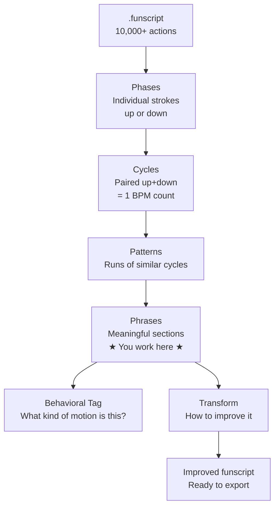

# Concepts

How FunscriptForge thinks about motion — and what those words mean in the app.

---

## The hierarchy

FunscriptForge builds a five-level hierarchy from your funscript automatically. You only ever interact with the top level (**phrases**) — everything below is computed for you.



---

## Phase

The smallest unit of motion. A phase is a single continuous movement in one direction — either up or down.

Every funscript is a sequence of alternating phases:

```
up → down → up → down → up → down → ...
```

A phase has a start time, an end time, and a direction. That is all.

---

## Cycle

One complete oscillation: an up phase followed by a down phase.

```
[up + down] = 1 cycle
```

BPM is measured in cycles. 120 BPM means 120 complete up-down oscillations per minute.

Each cycle also has an amplitude range — the distance between the lowest and highest position within that oscillation.

---

## Pattern

A run of cycles that share similar timing and velocity. When the same oscillation shape repeats several times in a row, FunscriptForge groups it into a pattern.

Patterns are labeled by their direction sequence (e.g., `"up → down"`, `"up → down → up → down"`). They are the building blocks of phrases.

---

## Phrase

A meaningful section of your funscript — the level at which FunscriptForge lets you work.

Think of a phrase the way you think of a verse or chorus in a song. Each phrase has a dominant character: energetic, building, quiet, frantic.

**Phrases are what you click, edit, and transform.** The app's Phrase Selector shows your entire funscript as a sequence of phrase bands. The Phrase Editor opens one phrase at a time.

A phrase has:
- Start and end times
- Average BPM
- Cycle count
- A behavioral tag
- Structural metrics (mean position, amplitude span, velocity)

---

## Behavioral tag

After building the phrase hierarchy, FunscriptForge classifies each phrase by its motion characteristics. The tag names the problem — if there is one.

| Tag | What it means |
|---|---|
| **stingy** | Full-range hammering — very fast, very demanding, no nuance |
| **giggle** | Tiny micro-motion centered around 50 — barely perceptible |
| **plateau** | Small band motion — some stroke, but lacking range |
| **drift** | Motion displaced into the top or bottom third of the range |
| **half_stroke** | Real stroke depth, but confined to one half (top or bottom) |
| **drone** | Sustained uniform motion — monotone, repetitive, fatiguing |
| **lazy** | Slow and shallow — low BPM, narrow amplitude |
| **frantic** | BPM above 200 — near or above device mechanical limits |

Phrases without a tag are well-formed. They still get an auto-suggested transform in the Export tab, but they do not need correction.

See [Behavioral Tags →](reference/behavioral-tags.md) for the full definition of each tag and recommended fixes.

---

## BPM transition

A point in the funscript where the tempo changes significantly. FunscriptForge detects these automatically by comparing BPM between consecutive phrases.

BPM transitions appear as thin vertical markers on the Phrase Selector chart. They often correspond to scene changes in the source video.

---

## Transform

An operation applied to a phrase that changes how it feels. A transform does not change *when* things happen — it changes *how* they happen: the stroke range, the velocity shape, the dynamics, the smoothing.

There are 25 built-in transforms. See [Transforms →](guide/transforms.md) for the full reference.

Transforms are non-destructive until you export. Accept a transform to mark it for export; reject it in the Export tab to remove it. Undo with **Ctrl+Z**.

---

## Assessment

The full analysis result for a funscript — all phases, cycles, patterns, phrases, BPM transitions, and behavioral tags combined into one structured data object.

FunscriptForge runs the assessment automatically when you load a file. You can also re-run it with adjusted detection settings (minimum phrase length, amplitude sensitivity) from the Phrase Selector's **Detection settings** expander.

---

## Export outputs

FunscriptForge produces two output files:

**Device funscript** (`.device.funscript`) — velocity-capped at 200 pos/s for mechanical devices.

**Estim funscript** (`.estim.funscript`) — no velocity cap, clean waveform for electrostim routing.

See [Device Safety →](reference/device-safety.md) for full details.
