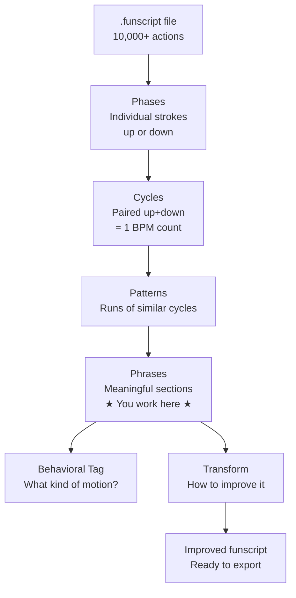

# Concepts and Definitions

> Read this before you start. You don't need to memorize it — just scan it once so the
> words make sense when you see them in the app.

---

## The vocabulary FunscriptForge uses

### Funscript

A `.funscript` file is a list of timed instructions for a haptic device. Each instruction
says: *at this moment in the video, move to this position.* Position is a number from 0
(bottom) to 100 (top). The device follows that list in sync with the video.

A funscript with 10,000 actions is just 10,000 of these `{timestamp, position}` pairs.
FunscriptForge reads that list and finds structure inside it.

---

### Phase

The smallest unit FunscriptForge works with. A phase is a single movement in one
direction — either a stroke up or a stroke down.

Every funscript is, at its core, a sequence of phases alternating between up and down.

```
up → down → up → down → up → down → ...
```

---

### Cycle

A pair of phases: one up, one down. A complete oscillation.

```
[up + down] = 1 cycle
```

BPM (beats per minute) is measured in cycles — 120 BPM means 120 complete
up-down oscillations per minute.

---

### Pattern

A run of cycles that have similar timing and velocity. When the same cycle shape
repeats several times in a row, FunscriptForge groups it into a pattern.

Patterns are the building blocks of phrases. A phrase is usually made up of one
or more patterns.

---

### Phrase

A meaningful section of the funscript — the level at which FunscriptForge lets you
work. A phrase might be a few seconds or several minutes long.

Think of a phrase the way you think of a verse or chorus in a song. Each phrase has
a dominant character: energetic, building, quiet, frantic.

**This is the level you interact with in the app.** You select phrases, apply transforms
to phrases, and review phrases in the chart.

---

### Behavioral Tag

FunscriptForge classifies each phrase into one of ten behavioral types based on its
motion characteristics:

| Tag | What it means |
|---|---|
| **giggle** | Short, fast, light strokes |
| **frantic** | High BPM, full range, relentless |
| **ramp** | Tempo or intensity builds over the phrase |
| **plateau** | Steady BPM and range throughout |
| **stingy** | Short stroke range (device barely moves) |
| **half-stroke** | Motion stays in only the top or bottom half |
| **drift** | Slow, wandering, low tempo |
| **drone** | Very regular, machine-like rhythm |
| **lazy** | Low velocity, soft strokes |
| **ambient** | Near-still, minimal motion |

Tags help you find similar phrases across a long script. The Pattern Editor lets
you work on all phrases of a given tag at once.

---

### BPM Transition

A point in the funscript where the tempo changes significantly. FunscriptForge
detects these automatically. They often correspond to scene changes in the video.

---

### Transform

An operation you apply to a phrase to change how it feels. A transform does not
change *when* things happen — it changes *how* they happen: the stroke range,
the velocity shape, the smoothing, the dynamics.

Examples of transforms:
- **Smooth** — softens abrupt transitions within the phrase
- **Dynamics** — adds variation to otherwise flat intensity
- **Performance** — adds expression to mechanical-sounding motion
- **Break** — makes a calm section feel genuinely quiet

You choose which transform to apply to each phrase. FunscriptForge will also
suggest transforms based on the phrase's behavioral tag.

---

## How the pieces fit together



FunscriptForge builds this hierarchy automatically when you load a file. You only
ever need to think about **phrases** and **transforms** — everything below is
computed for you.

---

## What FunscriptForge does NOT do

- It does not generate a funscript from a video
- It does not sync audio to motion automatically
- It does not control your device directly

It takes an existing funscript and makes it better. That's the job.

---

## Next step

[Install FunscriptForge →](../01-getting-started/install.md)

---

*© 2026 [Liquid Releasing](https://github.com/liquid-releasing). All rights reserved.*
