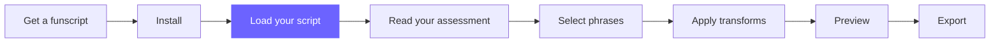

# Load Your First Funscript

**Your journey:**
[Get a funscript](../00-overview/index.md) →
[Install](./install.md) →
**Load your script** →
[Read your assessment](../02-understand-your-script/reading-the-assessment.md) →
[Select phrases](../02-understand-your-script/phrases-at-a-glance.md) →
[Apply transforms](../03-improve-your-script/apply-a-transform.md) →
[Preview](../03-improve-your-script/preview-your-changes.md) →
[Export](../04-export-and-use/export.md)

---

## Overview

In this step you load a funscript into FunscriptForge and see your first assessment.
By the end you will have a chart showing the full motion structure of your script —
every phrase highlighted, color-coded by behavior, with a summary of what the analyzer found.

This is the moment the app earns its keep: for the first time you will see your
funscript as structure, not just as a waveform.

---

## Why do this

A raw funscript is a list of timestamps and positions. FunscriptForge reads that list
and finds the *shape* inside it — the natural phrases, the tempo changes, the behavioral
patterns. You need to see this map before you can improve anything.

**What to expect:** Analysis runs in a few seconds for scripts up to an hour long.
Longer scripts (90+ minutes) may take 10–20 seconds. A progress indicator shows each
pipeline stage as it runs.

---

## Prerequisites

- FunscriptForge is installed and running in your browser
  ([Install FunscriptForge →](./install.md) if you have not done this yet)
- A `.funscript` file on your computer

> **Don't have a funscript?** See the [overview page](../00-overview/index.md) for tools
> that create funscripts from video. Come back once you have a file to work with.

---

## Steps

### 1. Find the file path to your funscript

You need the full path to your `.funscript` file. The fastest way:

**Windows:**
Open File Explorer, navigate to your file, hold **Shift** and right-click it →
**Copy as path**. The path looks like:

```text
C:\Users\YourName\Videos\myscript.funscript
```

**macOS:**
Right-click the file in Finder → **Get Info** → copy the path from the **Where** field.
Or drag the file onto a Terminal window to paste its path.

**Linux:**
Right-click → Properties, or drag the file to a terminal to get the full path.

---

### 2. Paste the path into FunscriptForge

In the FunscriptForge sidebar, find the **Funscript file** input at the top.
Paste your full file path and press **Enter** (or click **Load**).

> **TODO: insert screenshot — sidebar with file path input highlighted, cursor in field**

---

### 3. Watch the analysis run

A progress indicator appears showing the pipeline stages:

```text
Parsing → Phases → Cycles → Patterns → Phrases → BPM transitions
```

This usually completes in 2–5 seconds. For a 10-minute script you might see it
move through each stage. For a short clip it finishes almost instantly.

> **TODO: insert screenshot — progress indicator mid-run**

---

### 4. Read the chart

When analysis finishes the main area shows:

- **The full funscript chart** — every action plotted as a waveform
- **Phrase bounding boxes** — colored rectangles overlaid on the chart, one per phrase
- **Assessment summary** — total phrases, phrase durations, BPM range, behavioral tags found


The color of each phrase box indicates its dominant behavior:

| Color | Behavior |
| --- | --- |
| Blue / purple | Moderate, rhythmic |
| Orange / warm | Energetic, frantic, or ramp |
| Muted / grey | Ambient, break, or low activity |

> The chart above uses the same color scheme — orange phrases are the energetic peak
> from 1:26–2:10, purple phrases are the rhythmic sections at either end.

---

### 5. Scroll through the phrase list

Below the chart (or in the sidebar depending on your screen size) is a list of every
phrase detected. Each row shows:

- Phrase number and time range
- Duration
- Dominant behavioral tag
- BPM

Scroll through it. Click any row to jump that phrase's detail in the chart.

> **TODO: insert screenshot — phrase list with one row selected**

---

## You should see

- A chart that covers your entire funscript with phrase boxes visible
- An assessment summary showing at least one phrase detected
- A phrase list you can scroll and click

If your script is very short (under 30 seconds) or very uniform in tempo, you may see
only one or two phrases — that is normal. The [concepts page](../../reference/concepts.md)
explains how phrases are detected.

---

## What you did

FunscriptForge parsed your funscript, broke it into phases (individual up/down movements),
grouped those into cycles (complete oscillations), recognized repeated cycles as patterns,
and organized patterns into phrases (meaningful sections). You now have a structural map
of your script.

This map is what everything else in FunscriptForge is built on. Every transform, every
customization, every export improvement works at the phrase level.

---

Something not working? [Troubleshoot loading a script →](../troubleshooting/loading-a-script.md)

---

## Next step

[Read your assessment →](../02-understand-your-script/reading-the-assessment.md)

---

## You might be wondering

- [Why does my script only show one phrase?](https://funscriptforge.com/help?q=Why+does+my+script+only+show+one+phrase)
- [What do the phrase colors mean?](https://funscriptforge.com/help?q=What+do+the+phrase+colors+mean)
- [How long should my phrases be?](https://funscriptforge.com/help?q=How+long+should+phrases+be)

[Ask your own question →](https://funscriptforge.com/help)

---

## Related concepts

| | |
| --- | --- |
| **[Phrases](../../reference/concepts.md#phrase)** | What a phrase is and how FunscriptForge detects them |
| **[Behavioral tags](../../reference/concepts.md#behavioral-tag)** | The 10 motion types and what they mean |
| **[Assessment deep dive](../../reference/assessment-deep-dive.md)** | Every number in the assessment panel explained |

---



*© 2026 [Liquid Releasing](https://github.com/liquid-releasing). All rights reserved.*
