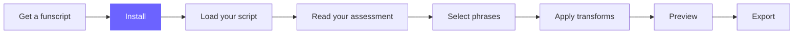
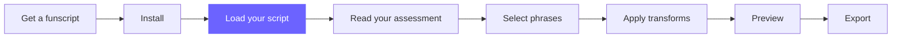
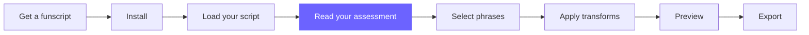
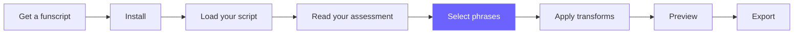
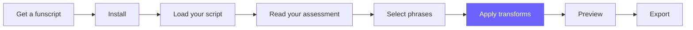
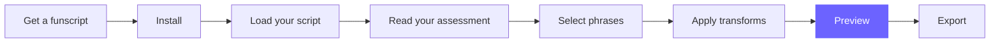

# Journey Map — Canonical Reference

> This file defines the task-based journey map used as a footer on every tutorial page.
> Copy the appropriate version (with the correct node highlighted) into each page.
> Do not render this file directly.

---

## The journey (8 tasks)

```
Get a funscript → Install → Load your script → Read your assessment →
Select phrases → Apply transforms → Preview → Export
```

---

## Mermaid snippets — one per page

### 00-overview/index.md  (Get a funscript)


### 01-getting-started/install.md  (Install)


### 01-getting-started/your-first-funscript.md  (Load your script)


### 02-understand-your-script/reading-the-assessment.md  (Read your assessment)


### 02-understand-your-script/phrases-at-a-glance.md  (Select phrases)


### 03-improve-your-script/apply-a-transform.md  (Apply transforms)


### 03-improve-your-script/preview-your-changes.md  (Preview)


### 04-export-and-use/export.md  (Export)

