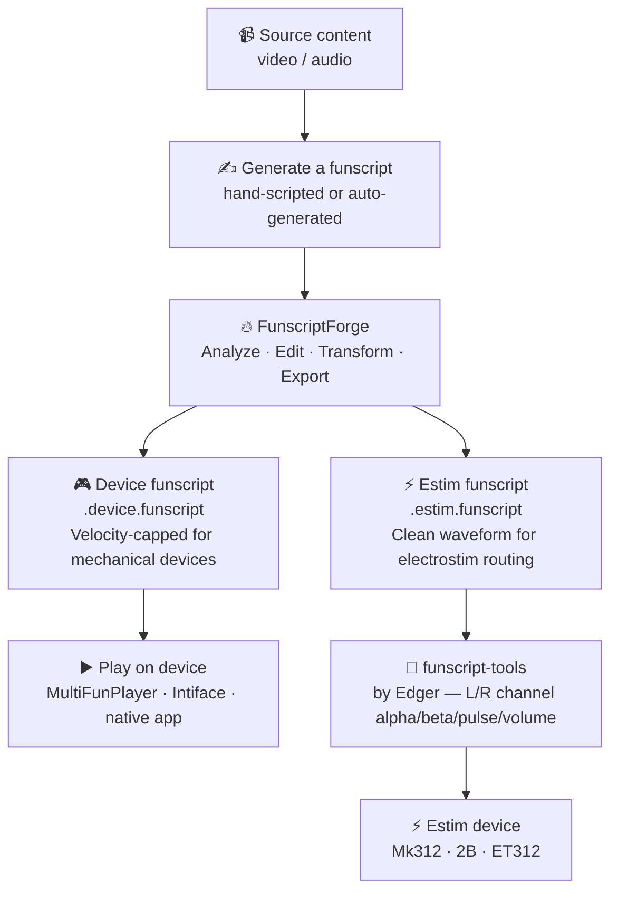

# Why FunscriptForge?

A funscript is a list of timestamps and positions. When it works well, you don't think about it — the device follows the content and everything feels natural and engaging. When it doesn't, the experience ranges from underwhelming to uncomfortable.

Most raw funscripts — whether hand-scripted or algorithmically generated — have the same problems. FunscriptForge was built to fix them.

---

## The full picture

FunscriptForge is one step in a larger workflow. Here is where it fits:



---

## Step 1 — Generate a funscript

FunscriptForge improves existing funscripts. You need a `.funscript` file before you can do anything with it.

### Where to get funscripts

**Community scripts** — Sites like [STASH](https://stashdb.org) and the [EroScripts community](https://discuss.eroscripts.com) host thousands of hand-crafted funscripts for popular content.

**Hand-scripting** — Create your own script frame by frame using dedicated tools:

- [OpenFunscripter](https://github.com/OpenFunscripter/OFS) — the most widely used free tool; keyboard-driven, precise
- [ScriptPlayer](https://github.com/FredTungsten/ScriptPlayer) — lightweight, good for quick scripting and playback

**Auto-generation** — Generate a first draft from video automatically:

- [PythonDancer](https://github.com/michael-mueller-git/Python-Funscript-Editor) — optical flow + beat detection; produces a rough draft you then refine
- Motion capture pipelines — OpenCV optical flow, motion magnitude estimation

All auto-generated scripts benefit from a FunscriptForge pass — the output is structurally valid but behaviorally flat.

### FunscriptForge Editor *(coming soon)*

We are building a dedicated funscript editor — **FunscriptForge Editor** — that integrates generation, editing, and the FunscriptForge improvement pipeline in a single tool. Beat-driven, audio-synced, designed for the whole workflow from scratch to export.

Until it ships, OpenFunscripter + FunscriptForge is the recommended path.

---

## Step 2 — Forge it

This is what FunscriptForge does. Load your script, see its full motion structure, fix what is wrong, and export improved outputs for device and estim.

```text
Raw .funscript
      │
      ▼
  Structural analysis
  Phases → Cycles → Patterns → Phrases → BPM transitions
      │
      ▼
  Behavioral classification
  Each phrase labeled: stingy, giggle, plateau, drift, frantic...
      │
      ▼
  Interactive editing
  Click any phrase. Choose a transform. Live before/after preview.
      │
      ▼
  Export
  .device.funscript  →  velocity-capped for mechanical devices
  .estim.funscript   →  clean waveform for electrostim routing
```

<!-- SCREENSHOT: Phrase Selector chart fully loaded — heatmap with phrase bands and BPM labels. Caption: "FunscriptForge shows your funscript as structure: every phrase visible, every behavior labeled, every tempo change marked." -->

See [Forge Your First Funscript →](getting-started/forge-your-first-funscript.md) to get started.

---

## Step 3 — Play it on a device

### Mechanical devices

Load the `.device.funscript` into any compatible player:

- **[MultiFunPlayer](https://github.com/Yoooi0/MultiFunPlayer)** — the most capable open-source player; supports multi-axis devices, multi-script sync, fine-grained control
- **[Intiface Central](https://intiface.com/central/)** + a Buttplug.io compatible app — wide device support including the Handy, OSR2, and SR6
- **[ScriptPlayer](https://github.com/FredTungsten/ScriptPlayer)** — simple, lightweight, good for quick playback
- **[HereSphere](https://heresphere.com/)** — VR player with built-in funscript support

### Electrostim devices

Load the `.estim.funscript` into **[funscript-tools](https://github.com/edger477/funscript-tools)** by Edger. This tool converts the funscript waveform into per-channel alpha/beta/pulse/volume files for routing through estim boxes (Mk312, 2B, ET312).

The estim output from FunscriptForge is intentionally clean — no velocity cap, no safety smoothing — so funscript-tools gets the full waveform to work with.

---

## What gets better after forging

### Stroke depth (amplitude)

Scripts with tiny strokes waste the device's range. Scripts with strokes that are too large strain it. FunscriptForge shows you exactly where amplitude is wrong and fixes it without touching the timing.

### Tempo control

Very fast sections (above 200 BPM) exceed what most mechanical devices can execute. FunscriptForge detects these and can halve the tempo while preserving the feel.

### Centering

Strokes confined to the top or bottom half of the range lose half the device's capability. FunscriptForge detects off-center phrases and recenters them.

### Monotony

Long sections with no variation fatigue quickly. FunscriptForge detects drone behavior and can add beat accents, contrast, or variation to break it up.

### Transitions

When adjacent phrases get different transforms, the boundary between them can produce a velocity spike. Seam blending detects these and smooths only the transitions — leaving the phrases themselves untouched.

### Device safety

Velocity above 300 pos/s can damage some mechanical devices. The quality gate flags everything above safe limits before you download.

---

## What FunscriptForge does NOT do

- It does not generate a funscript from a video *(that is coming — see FunscriptForge Editor above)*
- It does not drive your device — use MultiFunPlayer or Intiface for playback
- It does not sync audio automatically — BPM detection shows you where tempo changes, but beat alignment is a manual step
- It does not require an internet connection — everything runs locally

---

## Next steps

| I want to… | Go to… |
| --- | --- |
| Get the app running | [Install FunscriptForge →](getting-started/install.md) |
| Load my first script | [Forge Your First Funscript →](getting-started/forge-your-first-funscript.md) |
| Understand the vocabulary | [Concepts →](concepts.md) |
| Learn every transform | [Transforms →](guide/transforms.md) |
| Use the command line | [CLI Reference →](reference/cli.md) |
| Understand device vs estim | [Device Safety →](reference/device-safety.md) |
