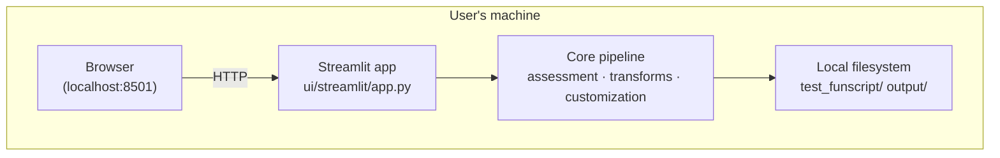
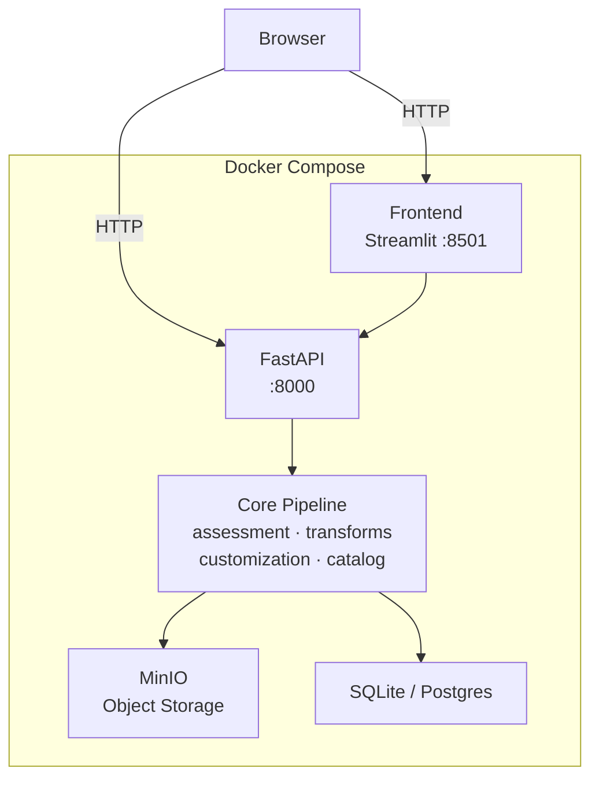
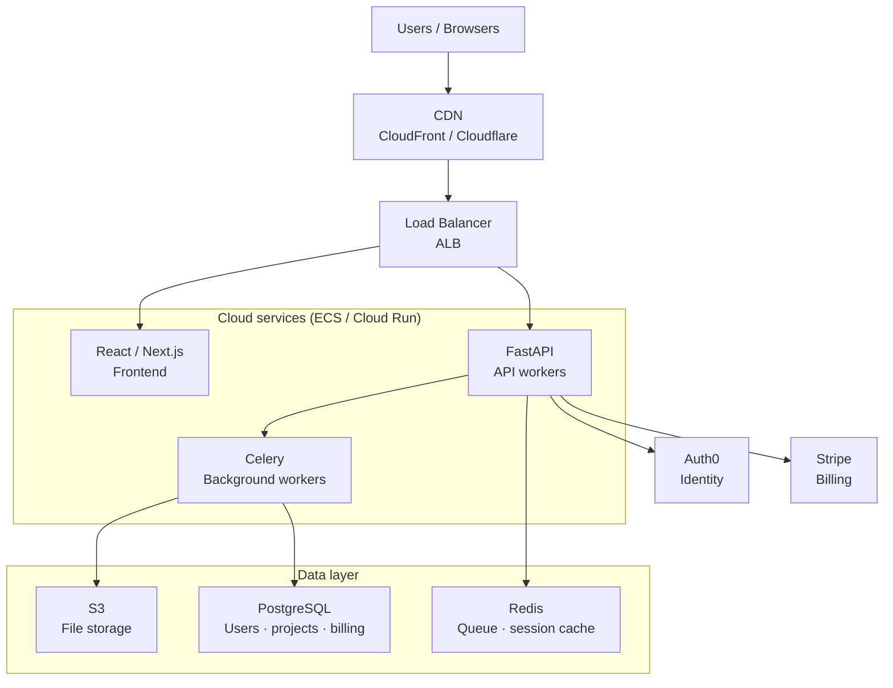
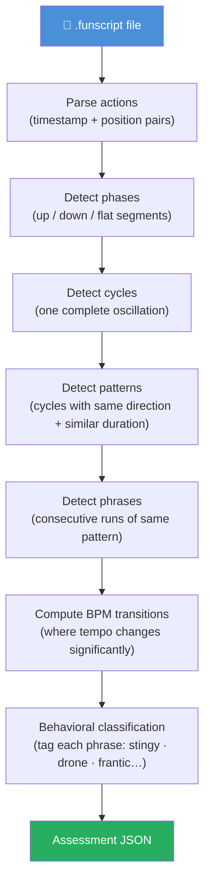
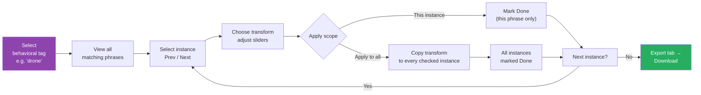
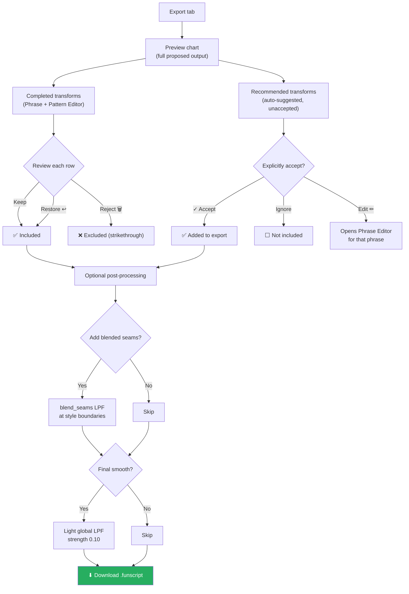
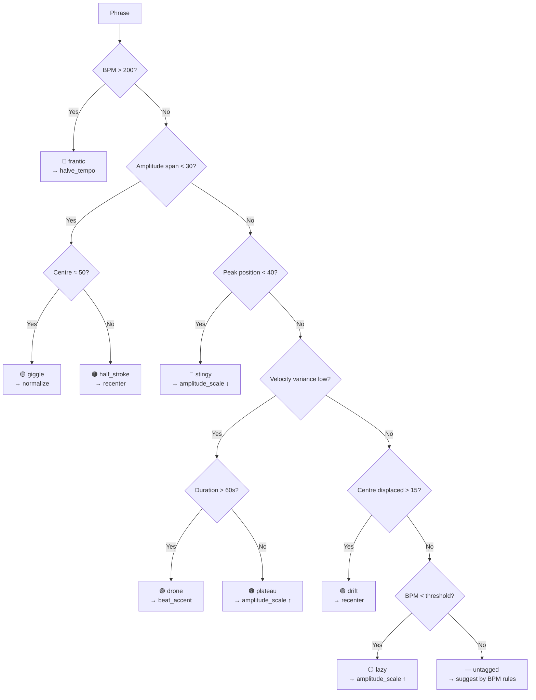
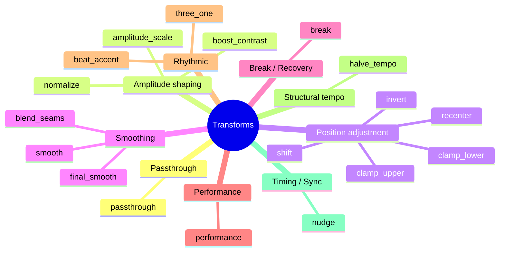
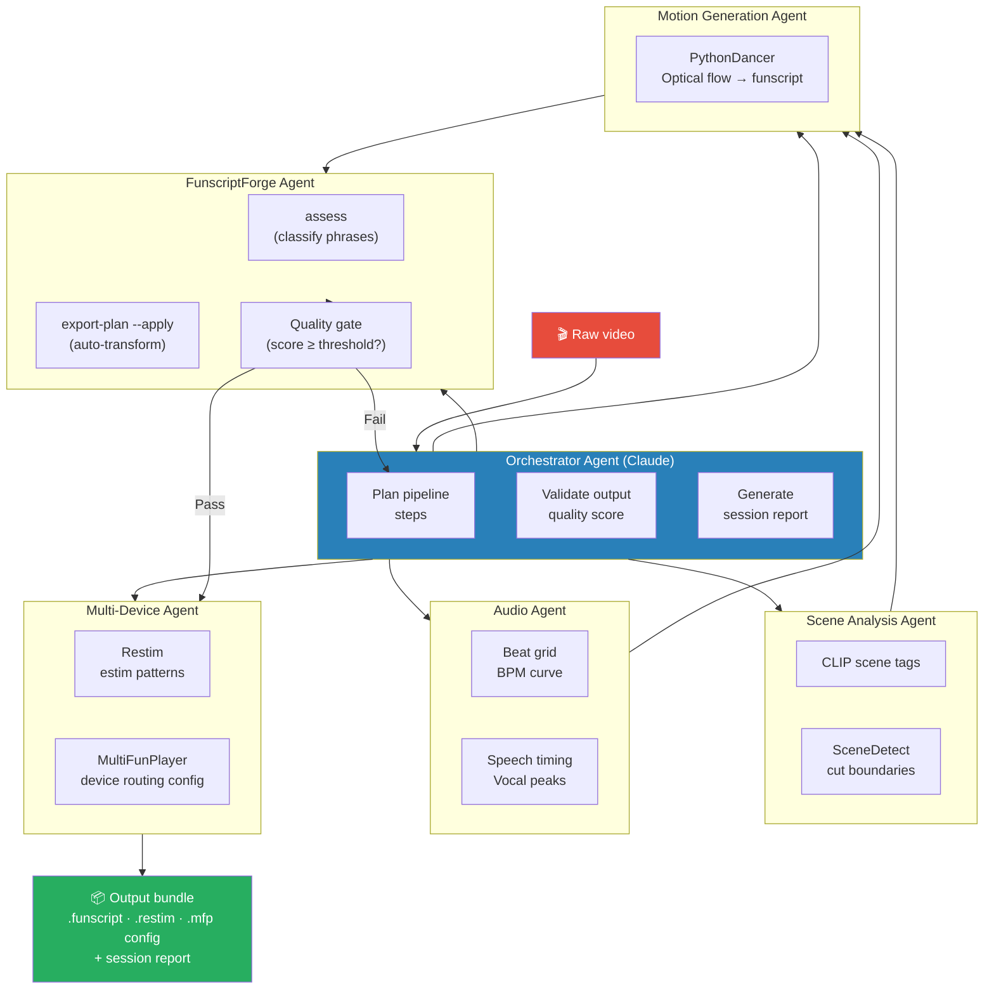
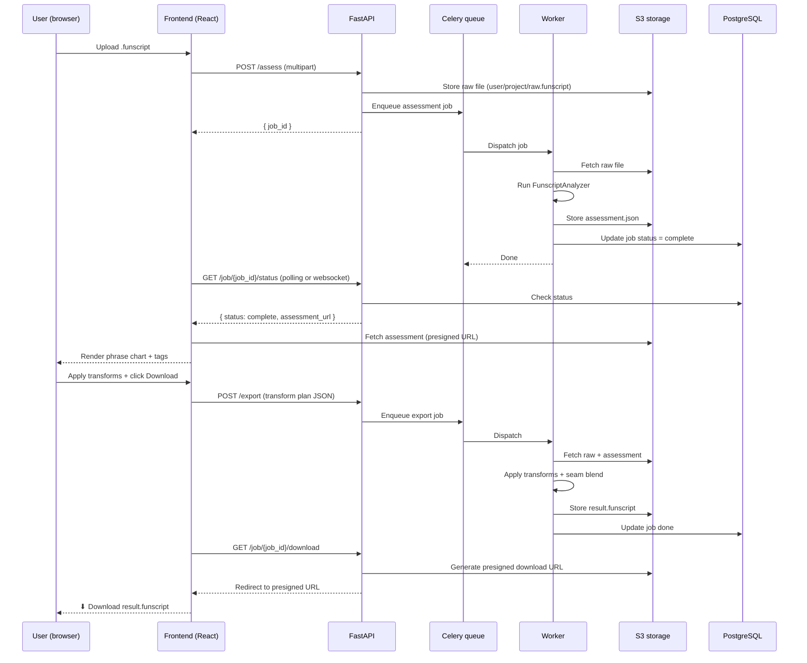

# FunscriptForge — Mermaid Diagrams

All diagrams render natively on GitHub and in any Mermaid-compatible viewer.

---

## 1. Deployment architectures

### Local mode



### Self-hosted Docker mode



### Cloud SaaS mode



---

## 2. Core pipeline flow



---

## 3. User workflow — Phrase Editor

```mermaid
sequenceDiagram
    participant U as User
    participant UI as Phrase Editor
    participant FS as FunscriptForge

    U->>UI: Load funscript
    UI->>FS: Run assessment pipeline
    FS-->>UI: Assessment JSON (phrases + tags)
    UI-->>U: Colour-coded chart with phrase boxes

    U->>UI: Click a phrase
    UI-->>U: Detail panel opens (Original chart)

    U->>UI: Select transform + adjust sliders
    UI->>FS: Compute preview
    FS-->>UI: Transformed actions
    UI-->>U: Before / After preview

    alt Accept
        U->>UI: Click ✓ Accept
        UI-->>U: Transform stored; return to selector
    else Cancel
        U->>UI: Click ✕ Cancel
        UI-->>U: Discard; return to selector (others unaffected)
    else Split
        U->>UI: Click ✂ Split phrase
        UI-->>U: Cycle slider + dashed split line on chart
        U->>UI: Drag to cycle boundary + confirm
        UI-->>U: Two new phrases created; navigate to A
    end
```

---

## 4. User workflow — Pattern Editor (batch fix)



---

## 5. User workflow — Export



---

## 6. Behavioral classification — decision tree



---

## 7. Transform catalog — groups



---

## 8. Agentic AI pipeline (vision)



---

## 9. SaaS data flow


