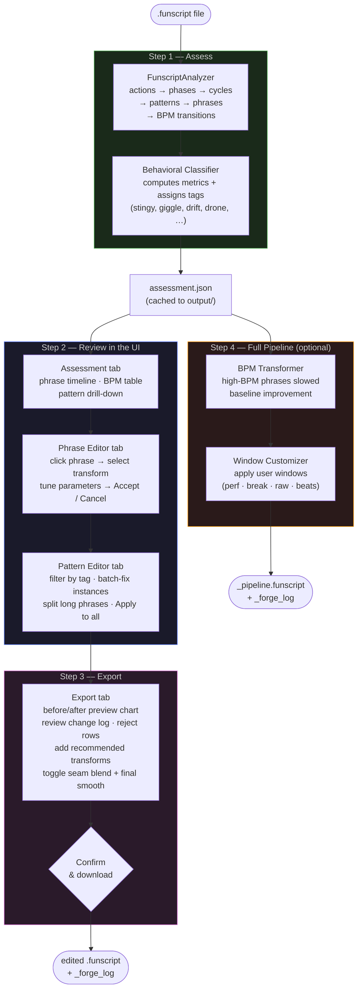

# Funscript Forge — Workflow Overview

This document describes the intended end-to-end workflow for improving a funscript using Funscript Forge.

---

## The five-stage pipeline



---

## Step-by-step description

### Step 1 — Assess

The analyzer reads the raw `{at, pos}` action list and works through five stages to build a structural picture:

```
actions → phases → cycles → patterns → phrases → BPM transitions
```

1. **Phases** — scan for direction reversals; label each segment `upward`, `downward`, or `flat`
2. **Cycles** — pair each up phase with the next down phase (one complete oscillation)
3. **Patterns** — group cycles that share the same direction sequence and similar duration
4. **Phrases** — merge consecutive cycles of the same pattern into a single time window with a BPM value
5. **BPM transitions** — flag phrase boundaries where tempo changes significantly

The behavioral classifier then computes per-phrase metrics (mean position, amplitude span, mean velocity, BPM coefficient of variation) and assigns behavioral tags.

The result is saved as `output/<name>.assessment.json` and is the input to every subsequent step.

---

### Step 2 — Review in the UI

Open the Streamlit app (`python launcher.py`) and load your funscript. Three editing tabs are available:

**Assessment tab** — read-only overview. Shows the colour-coded phrase timeline, BPM transitions table, and drill-down detail for every phrase, pattern, and cycle. Use this to understand what the analyzer found before making any changes.

**Phrase Editor tab** — click any phrase on the full-funscript chart to open its detail panel. Choose a transform from the dropdown, tune its parameters with live sliders, and preview the Before / After result. Click ✓ Accept to store the change or ✕ Cancel to discard it. Use **Apply to all** to copy the same transform to every other phrase that shares the same behavioral tag.

**Pattern Editor tab** — filter phrases by tag to see all instances of a behavioral problem at once. Each instance shows an original chart and a live preview. For long phrases you can split the window into sub-ranges and apply a different transform to each segment. **Apply to all** copies the split structure (scaled proportionally to each instance's duration) to every matching phrase.

---

### Step 3 — Export

The Export tab aggregates all accepted transforms and lets you review them before downloading.

1. The **preview chart** shows the proposed final funscript (with optional Before/After overlay)
2. The **change log** lists every planned transform with start/end time, transform name, source, and before → after BPM
3. Click 🗑 on any row to reject that change
4. **Recommended transforms** for untouched phrases are listed separately and must be individually accepted
5. Toggle **Blend seams** and **Final smooth** as desired
6. Check the confirmation checkbox and click **Download edited funscript**

Every downloaded file embeds a `_forge_log` key so the session is reproducible.

---

### Step 4 — Full Pipeline (optional)

For a faster, non-interactive workflow, the full pipeline can be run either from the Export tab (browser) or the CLI.

**Browser**: expand *"Run full pipeline"* in the Export tab, adjust sliders, click **▶ Run Pipeline**, then download the `_pipeline.funscript`.

**CLI**:
```bash
# Single combined command
python cli.py pipeline input.funscript --output-dir output/

# Or run the three steps explicitly
python cli.py assess     input.funscript --output output/assessment.json
python cli.py transform  input.funscript --assessment output/assessment.json --output output/transformed.funscript
python cli.py customize  output/transformed.funscript --assessment output/assessment.json --output output/final.funscript
```

The pipeline result is independent of any phrase-editor transforms and is saved as a separate file.

---

## Decision guide

| Goal | Recommended path |
| --- | --- |
| Quick baseline improvement with no manual review | CLI `pipeline` command |
| Fix specific behavioral issues (stingy, drift, giggle, …) | Phrase Editor + Pattern Editor → Export |
| Align timing to music beats | Add beat windows → `customize` step |
| Soften or silence a section | Add break window → `customize` step |
| Long funscript with one uniform tempo | Use phrase split in Pattern Editor |
| Reproduce a previous session exactly | Re-apply transforms from the `_forge_log` |
